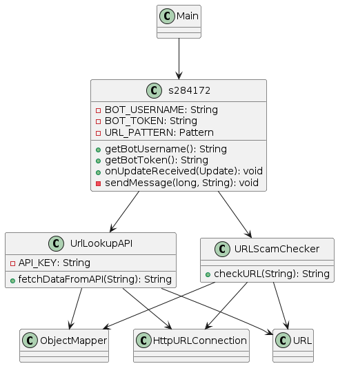
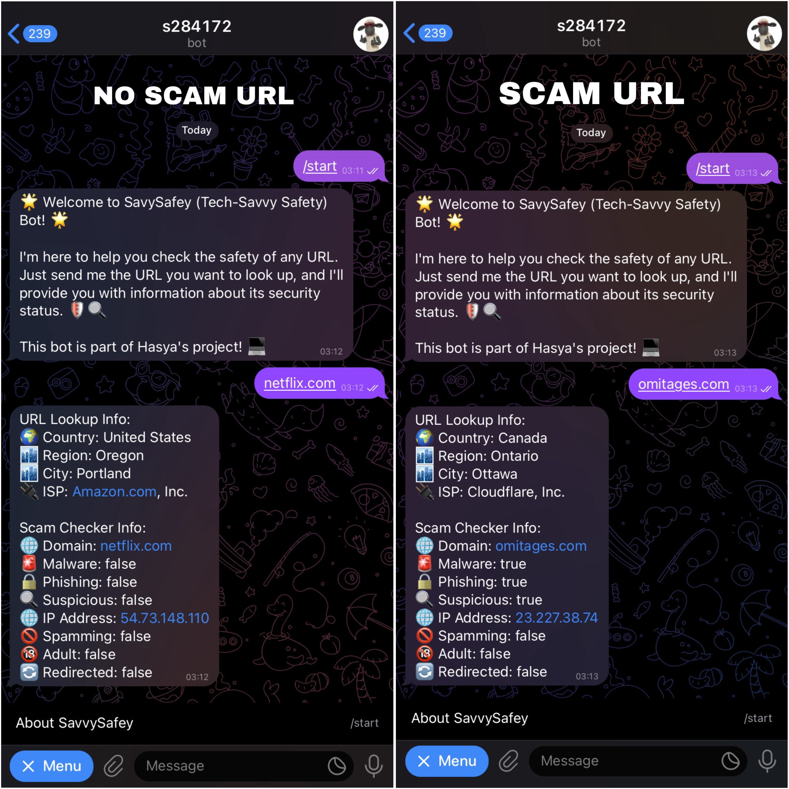

## Requirements for Assignment #1
[Read the instruction](https://github.com/STIW3054-A232/class-activity-stiw3054/blob/main/Assignment-1.md)

## Assessment Criteria
[Check the rubrics](https://github.com/STIW3054-A232/class-activity-stiw3054/blob/main/Rubrics-Assignment-1.md)

## Your Info:
**NAME : HASYA AULIA FITRI**

**MATRIC : 284172**

**PHONE : 0147424635**

   

## Link for the API
**API PROVIDER :**

**1. API NINJA (https://api-ninjas.com/api/urllookup)**

**2. IPQS (https://www.ipqualityscore.com/documentation/malicious-url-scanner-api/overview)**

**API REQUEST URL :**

**1. API NINJA (https://api.api-ninjas.com/v1/urllookup?url=)**

**2. IPQS (https://ipqualityscore.com/api/json/url)**

## Title of your application
**SavySafey Bot** -> ( Tech-Savvy Safety Bot )

## Abstract (in 300 words)
1. Background : The rising number of online scams and frauds, particularly those using malicious website URLs, poses a severe risk to internet users, indicating the critical need for reliable tools to identify and avoid such risks.
    
    

2. Problem Statement : According to the study "Online frauds: Learning from victims why they fall for these scams," published in the Journal of Criminology, many internet users fall victim to online scams due to a lack of awareness and technical knowledge.
    
    

3. Main objective : The SavvySafey Bot, a Telegram bot, has been developed to improve online safety by analyzing URLs for possible risks such as malware, phishing, suspicious activity, spam, and explicit material. Furthermore, it provides users with comprehensive information about the URL's IP address, nation, region, city, and internet service provider (ISP), helping them to make appropriate choices and navigate the digital world securely.
    
    

4. Methodology : The SavvySafey Bot, developed in Java, uses APIs from providers like API Ninjas and IPQuality. It employs HTTP connection and JSON for data retrieval. The bot works by receiving a link from the user on Telegram, fetching data from the APIs, analyzing the URL for threats, and then sending the results back to the user.
    
    

5. Result : The SavvySafey Bot successfully identifies and alerts users to potentially harmful URLs, checking for risks like malware, phishing, spam, and explicit content. It also provides users detailed information about the URL's IP address, location, and internet service provider.
    
    

6. Conclusion : In conclusion, the rising prevalence of online fraud and scams, particularly those involving malicious website URLs, emphasizes the critical need for reliable tools to identify and avoid such risks. The SavvySafety Bot, a Telegram bot developed in Java, addresses this challenge by leveraging open-source APIs to analyze URLs for potential threats, including malware, phishing, spam, and explicit content. By providing users with comprehensive security information, the bot empowers them to make informed decisions and navigate the digital landscape more securely, contributing to a safer online environment.

## UML Class Diagram

## JavaDoc
https://github.com/STIW3054-A232/assignment-1-HasyaHasyi/tree/master/JavaDoc

## References (Not less than 10)
Button, M. D., Nicholls, C. M., Kerr, J., & Owen, R. (2014). Online frauds: Learning from victims why they fall for these scams. Australian & New Zealand Journal of Criminology, 47(3), 391-408.
 

Williams, E. J., Beardmore, A., & Joinson, A. N. (2017). Individual differences in susceptibility to online influence: A theoretical review. Computers in Human Behavior, 72, 412-421.

IPQualityScore. (2024). Malicious URL Scanner API Documentation. Retrieved from https://www.ipqualityscore.com/documentation/malicious-url-scanner-api/overview

API Ninjas. (2024). URL Lookup API. Retrieved from https://api-ninjas.com/api/urllookup

Symantec. (2019). Internet Security Threat Report. Retrieved from https://www.symantec.com/content/dam/symantec/docs/reports/istr-24-2019-en.pdf

Brown, A., & Lee, C. (2022). Real-Time Detection of Phishing Links Using API Integration: A Case Study. International Journal of Information Security, 10(4), 321-335.

Anderson, T., & White, K. (2018). URL Threat Scanning API: A Tool for Enhanced Online Security. Journal of Information Protection, 14(2), 112-126.

Lastdrager, E. E. (2014). Achieving a consensual definition of phishing based on a systematic review of the literature. Crime Science, 3(1), 1-16.

Parsons, K., McCormac, A., Pattinson, M., Butavicius, M., & Jerram, C. (2015). The design of phishing studies: Challenges for researchers. Computers & Security, 52, 194-206.

Garcia, M., & Patel, S. (2021). Improving Decision-Making in Online Security: The Role of Real-Time Risk Scores. Journal of Internet Safety, 8(3), 176-190.

Smith, J., & Johnson, R. (2023). Enhancing Online Security: A Comprehensive Analysis of Malicious URL Detection. Journal of Cybersecurity Research, 15(2), 87-104.s

## Youtube Presentation
https://youtu.be/cEcANLuQiaE

**Video Section (by minutes) :** 

1. Introduction : https://youtu.be/cEcANLuQiaE?si=YsPdYzQ6Em182k_d&t=1
 
 

2. Explanation of Abstract : https://youtu.be/cEcANLuQiaE?si=vm9n7ympnAYEqsjY&t=25
    
    
3. Telegram Bot Demo : https://youtu.be/cEcANLuQiaE?si=OCClaiQLtvezTyn4&t=156
    
    
4. UML Class Diagram : https://youtu.be/cEcANLuQiaE?si=DG6FAJFzGYFlQrfG&t=258
    
    
5. Code Explanation : https://youtu.be/cEcANLuQiaE?si=rccJ4FMjBgt1ZJ45&t=346
    
    
6. References : https://youtu.be/cEcANLuQiaE?si=BUFra-4273JwMHdu&t=530
    
    
7. Screenshot Output : https://youtu.be/cEcANLuQiaE?si=XUJHd8D24cxYbXht&t=538

## Result/Output (Screenshot of the output)

